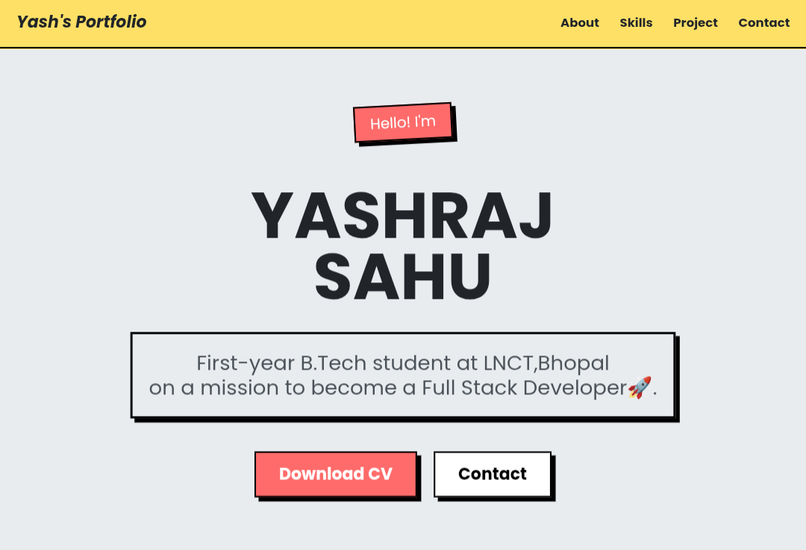

# 🌐 Yash's Portfolio

A clean, responsive personal portfolio website built with pure **HTML** and **CSS** — no frameworks, no dependencies.

> *"First-year B.Tech student at LNCT, Bhopal — on a mission to become a Full Stack Developer 🚀"*

---

## 🔗 Live Demo

**[View Portfolio →](https://yash-portfolio-ngb2e6njy-yashrajsahu44s-projects.vercel.app)**

---

## 📸 Preview



---

## ✨ Features

- **Responsive Design** — Fully optimized for mobile, tablet, and desktop
- **Clean UI/UX** — Minimal layout with a stable yellow + coral color scheme
- **Multi-section Layout** — About, Skills, Projects, and Contact
- **CV Download** — Resume accessible directly from the hero section
- **Pure HTML & CSS** — Zero dependencies, fast load time

---

## 📁 Project Structure

```
portfolio/
├── index.html       # Main HTML file
├── style.css        # Stylesheet
├── CV/              # Resume/CV files
└── Images/          # Profile and project images
```

---

## 📌 Sections

| Section | Description |
|---|---|
| **About** | Introduction and background |
| **Skills** | Technical skills and tools |
| **Projects** | Personal and academic projects |
| **Contact** | Ways to connect |

---

## 🛠️ Tech Stack


---

## 🚀 Getting Started

```bash
# Clone the repository
git clone https://github.com/yashrajsahu44/portfolio.git

# Open in browser
open index.html
```

---

## 📬 Contact

**Yashraj Sahu**
- 🌐 Portfolio: [Live Site](https://yash-portfolio-ngb2e6njy-yashrajsahu44s-projects.vercel.app)
- 💼 LinkedIn: [yashraj-sahu-588825375](https://www.linkedin.com/in/yashraj-sahu-588825375)
- 📧 Email: [yashsahu10th@gmail.com](mailto:yashsahu10th@gmail.com)
- 🐙 GitHub: [@yashrajsahu44](https://github.com/yashrajsahu44)

---

## 📄 License

This project is open source and available under the [MIT License](LICENSE).
